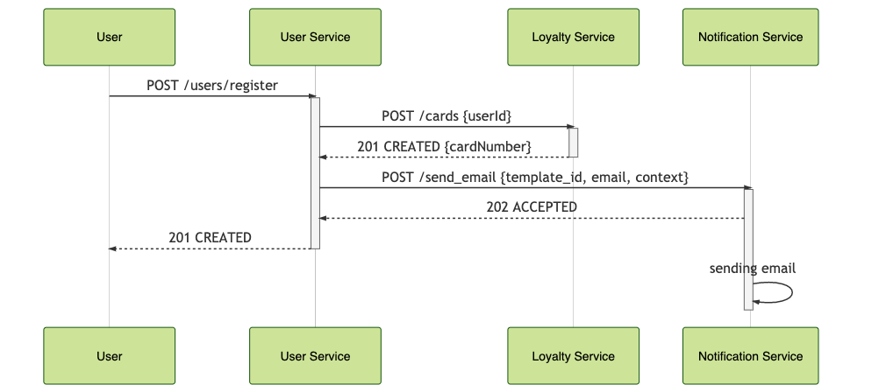

## Источник
[otus](https://github.com/schetinnikov-otus/arch-labs/tree/master/api-spec)

## Сценарий:

- Пользователь заходит на страничку регистрации. 
- Пользователь вводит в форму регистрации идентификационные данные и почту. 
- Пользователь нажимает на кнопку "Регистрация"
- Пользователю показывается информация об успешной регистрации. 
- Регистрируется карта лояльности.
- Через некоторое время пользователю приходит письмо об успешной регистрации вместе с номером карточки лояльности. 

## RESTful

[Описание REST интерфейсов](http://petstore.swagger.io/?url=https%3A%2F%2Fraw.githubusercontent.com%2Fp-12s%2Farch-labs%2F1-sync-monolit%2Fmaster%2Frest-openapi.yaml)

User Service фактически выполняет роль Оркестратора сервисов. Из-за синхронной модели взаимодействия User Service "ждет" дольше, чем надо. Потенциально можно было бы отдать ответ, как только был создан пользователь, а действия связанные с созданием карты и отсылкой почты - асинхронно. 

Но за счет синхронного взаимодействия схема получилась крайне простой и понятной.  

